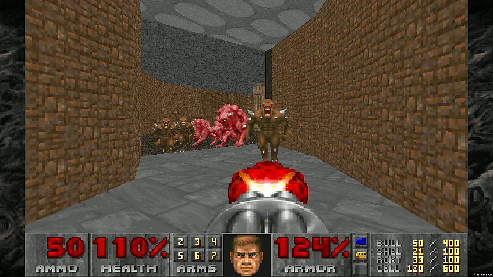

# Guía de Ejercicios 5 - Arreglos

```
Advertencia

La resolución conjunta o grupal de los ejercicios aquí presentes no está permitida, excepto en la medida en que puedas pedir ayuda a tus compañeros de clase y a otras personas, y siempre que esa ayuda no se reduzca a que otro haga el trabajo por vos.

El código fuente entregado por un estudiante debe ser escrito en su totalidad por dicha persona.
```

***<u>Condiciones de entrega:</u>***

| <b>¿Qué se entrega?</b>         | <b>¿Qué no se entrega?</b>                        |
| ----                            |   ----                                            |
| Archivos fuente/source (.c)     | Archivos objeto (.o)                              |
| Archivos encabezado/header (.h) | Archivos ejecutables (programa, app, a.out, etc.) |
| Bibliotecas específicas (.a)    |   |

<br>

Se deben entregar los tres ejercicios en un zip (usar template como ayuda para el formato).

<br>

**Importante:** Recordar validar **siempre** que no se reciben punteros **`NULL`**. En dicho caso, la función deberá retornar sin efectuar operación alguna y en caso de tener que retornar algún valor devolverá el valor `-1`.

## Ejercicios 5.1 - 5.5
Desarrolle un programa que solicite el ingreso de las calificaciones (como número enteros) del primer parcial de los estudiantes de Informática 1. El ingreso de calificaciones finalizará cuando se ingrese un once (11). Tener en cuenta que las calificaciones deberán ser números comprendidos entre 0 y 10 (0 significa ausente), por lo que se debe validar la carga de datos. Se podrán ingresar como máximo 25 calificaciones. Una vez finalizada la carga de datos, se pide computar e imprimir en pantalla las siguientes estadísticas:

### Ejercicio 5.1
- La cantidad de aprobados, desaprobados y ausentes (nota de aprobación: 6).

Utilizar el siguiente prototipo:

```c
void computar_estatus(const int* calificaciones, int cantidad, int* aprobados, int* desaprobados, int* ausentes);
```

### Ejercicio 5.2
- El valor medio (promedio) de las calificaciones (teniendo en cuenta los ausentes).

Utilizar el siguiente prototipo:

```c
float promedio_con_ausentes(const int* calificaciones, int cantidad);
```

### Ejercicio 5.3
- El valor medio (promedio) de las calificaciones (sin tener en cuenta los ausentes).

Utilizar el siguiente prototipo:

```c
float promedio_sin_ausentes(const int* calificaciones, int cantidad);
```

### Ejercicio 5.4
- La calificación máxima ingresada y su ubicación.

Utilizar el siguiente prototipo:

```c
int calificacion_maxima(const int* calificaciones, int cantidad, int* maximo);
```

### Ejercicio 5.5
- La calificación mínima ingresada y su ubicación.

Utilizar el siguiente prototipo:

```c
int calificacion_minima(const int* calificaciones, int cantidad, int* minimo);
```

## Ejercicio 5.6
Implementar una función que reciba dos arreglos y sus longitudes, y copie el contenido del arreglo origen en el arreglo destino. La función deberá retornar la cantidad de **bytes** copiados. Utilizar el siguiente prototipo:

```c
int arrcpy(float* arreglo_destino, int largo_destino, const float* arreglo_origen, int largo_origen);
```

## Ejercicio 5.7
Implementar una función que reciba dos arreglos y su longitud, y retorne **`1`** si son iguales y **`0`** si no lo son. Utilizar el siguiente prototipo:

```c
int son_iguales(const float* arreglo_a, const float* arreglo_b, int largo);
```

## Ejercicio 5.8
Implementar una función que reciba un arreglo y su longitud y retorne **`1`** si el mismo se encuentra ordenado (de menor a mayor) y **`0`** en caso contrario. Utilizar el siguiente prototipo:

```c
int esta_ordenado(const int* arreglo, int largo);
```

## Ejercicio 5.9
En informática, la [búsqueda lineal o búsqueda secuencial](https://es.wikipedia.org/wiki/B%C3%BAsqueda_lineal) es un método para encontrar un valor objetivo dentro de una lista. Ésta comprueba secuencialmente cada elemento de la lista con el valor objetivo hasta que es encontrado o hasta que todos los elementos hayan sido comparados. Se pide implementar una función que haciendo uso de dicho algoritmo devuelva la posición de un determinado elemento en un arreglo. En caso de que el elemento a buscar esté presente más de una vez, simplemente devolverá la posición de la primer occurrencia, y en caso de no estar presente en el arreglo, devolverá **`-1`**.

Utilizar el siguiente prototipo:

```c
int busqueda_lineal(const int* arreglo, int largo, int elemento);
```

## Ejercicio 5.10
Implementar una función que permita efectuar operaciones entre un vector y un escalar. Dicha función recibirá un arreglo de números reales, un número real, la operación a realizar entre ellos y el orden de los operandos.

Las operaciones soportadas son:
- Suma (`'+'`)
- Resta (`'-'`)
- Multiplicación (`'*'`)
- División (`'/'`)

Los ordenes soportados son:
- `ESCALAR_VECTOR` (0)
- `VECTOR_ESCALAR` (1)

Dado que una operación entre un vector y un escalar da como resultado otro vector, el resultado de la operación se almacenará en un arreglo de resultados. La función deberá retornar `ERROR` (-1) si ocurrió algún error, y `EXITO` (0) en caso contrario. Utilizar el siguiente prototipo:

```c
int computar_arreglo_escalar(double* vector, int largo, double escalar, char operacion, double* resultado);
```

## Ejercicio 5.11
Implementar una función que permita efectuar operaciones entre dos vectores. Dicha función recibirá dos arreglo de números reales y la operación a realizar entre ellos.

Las operaciones soportadas (todas elemento a elemento) son:
- Suma (`'+'`)
- Resta (`'-'`)
- Multiplicación (`'*'`)
- División (`'/'`)

Dado que una operación (elemento a elemento) entre dos vectores da como resultado otro vector, el resultado de la operación se almacenará en un arreglo de resultados. La función deberá retornar `ERROR` (-1) si ocurrió algún error, y `EXITO` (0) en caso contrario. Utilizar el siguiente prototipo:

```c
int computar_arreglo_arreglo(double* vector_a, double* vector_b, int largo, char operacion, double* resultado);
```

## Ejercicio 5.12
El producto escalar (o producto interno) es una operación entre vectores muy utilizada en juegos FPS (first-person shooter), tales como [Doom](https://es.wikipedia.org/wiki/Doom_(videojuego_de_1993)):



Esto se debe a que a través de dicha operación es posible obtener fácilmente el ángulo entre dos vectores, y por lo tanto, saber si el jugador está apuntando a un enemigo al momento de disparar lo cual podría ocasionar, por ejemplo, la destrucción de dicho enemigo.

Esto se debe a que el producto escalar se puede computar de dos formas distintas:

**Ecuación 1:**


<br>

**Ecuación 2:**


Con lo cual el procedimiento típico es computar el producto escalar entre ambos vectores con la segunda ecuación y luego despejar el ángulo entre ambos con la primera. Finalmente, si el ángulo es menor a un determinado ángulo límite, se puede considerar que el jugador está apuntando a dicho enemigo.

Para poder lograr lo anterior, una empresa de videojuegos nos pide que desarrollemos las siguientes funciones:

a) Implementar una función que compute el producto escalar de dos vectores de **dimensión 3**, utilizando la ecuación 2. Utilizar el siguiente prototipo:

```c
double producto_escalar(const double* vector_a, const double* vector_b);
```

b) Implementar una función que compute la norma de un vector de **dimensión 3**, la cual es requerida por la ecuación 1 y se calcula de la siguiente manera:

<div align="center">

</div>

Utilizar el siguiente prototipo:

```c
double norma(const double* vector);
```

c) Implementar una función que compute el ángulo de separación (en radianes) entre dos vectores, a partir de la ecuación 1 y haciendo uso de las funciones ya desarrolladas en los puntos **`a)`** y **`b)`**. Utilizar el siguiente prototipo:

```c
double angulo_entre_vectores(const double* vector_a, const double* vector_b);
```

d) Implementar una sencilla función que compruebe si un enemigo está siendo apuntado por el jugador, lo cual se puede deducir comprobando si el ángulo entre el vector del enemigo y el vector de la mira del jugador es menor que un cierto valor límite. Se deberá devolver **`1`** en caso que sea cierto y **`0`** en caso contrario. Hacer uso de las funciones ya desarrolladas en los puntos **`a)`**, **`b)`** y **`c)`**. Utilizar el siguiente prototipo:

```c
int esta_apuntando_al_enemigo(const double* vector_mira, const double* vector_enemigo, double angulo_limite);
```

## Ejercicio 5.13
La derivada nos da información acerca de la razón de cambio de una función y en el caso de la derivada discreta, nos información sobre dicha razón de cambio pero aplicado a un conjunto de elementos númericos discretos. En este ejercicio, se pide implementar una función que calcule la derivada discreta (por diferencias finitas) del contenido de un vector de enteros. El cálculo de dicha derivada discreta se realiza de la siguiente manera:
```
Para x = 0 => (∂f/∂x)[x] = 0
Para x > 0 => (∂f/∂x)[x] = F[x] − F[x − 1]

Siendo x el índice del arreglo.

Por ejemplo:
  (∂f/∂x)[0] = 0
  (∂f/∂x)[1] = F[1] - F[0]
  (∂f/∂x)[2] = F[2] - F[1]
  ...
```

Utilizar el siguiente prototipo:

```c
void derivar(const double* arreglo, int largo, double* derivada);
```

## Ejercicio 5.14
Implementar una función que permita evaluar una función polinómica en un punto, a partir de un
vector de coeficientes y su grado recibidos como parámetros. Utilizar el siguiente prototipo:

```c
double evaluar_polinomio(const double* coeficientes, int grado, double x);
```

## Ejercicio 5.15
Implementar una función que permita obtener los coeficientes de la función derivada de una función polinómica, a partir de un vector de coeficientes y su grado recibidos como parámetros. Utilizar el siguiente prototipo:

```c
void derivar_polinomio(const double* coeficientes, int grado, double* coeficientes_derivada);
```

## Ejercicio 5.16
Escribir un programa que genere una tabla con muestras de un polinomio ingresado por teclado. El programa debe pedir al usuario el grado del polinomio, los coeficientes del mismo, el valor del comienzo del intervalo de muestreo, el valor final y la cantidad de muestras. Para ello, implementar una función con el siguiente prototipo:

```c
void muestrear_polinomio(const double* coeficientes, int grado, double inicio, double fin, double* muestras, int cantidad_muestras);
```


Ejercicio 6.47.
Entrega Obligatoria
Una matriz de nxm elementos es simétrica, si y solo si:
 es una matriz cuadrada (m = n), y
 a ij = a ji para todo i, j =1,2,3,4,...,n.
donde a ij representa el elemento que está en la fila i-ésima y en la columna j-
ésima de A.
En base a lo anterior, escribir una función que reciba una matriz cuadrada de
enteros y su dimensión, y determine si es una matriz simétrica retornando el
resultado mediante una variable booleana.


Ejercicio 6.48.
Entrega Obligatoria
En Álgebra Lineal, la traza de una matriz cuadrada de nxn se define como la
suma de los elementos de su diagonal principal.
Es decir, t (A)=a 11 + a 22 + a 33 + ... + a nn .
En base a lo anterior escribir una función que reciba una matriz cuadrada de
doubles y su dimensión, y retorne el valor de su traza.


Ejercicio 6.49.
Entrega Obligatoria
Escribir una función que reciba una matriz cuadrada de doubles y su dimensión,
y retorne el valor de su determinante.

Ejercicio 6.50.
Escribir una función que recibe como argumentos una matriz de enteros de N x
M, y los enteros N y M, y obtenga la transpuesta de dicha matriz.


Ejercicio 6.51.
Entrega Obligatoria
Escribir una función que reciba dos matrices de dimensiones NxM y MxP, y cuatro
enteros dando filas y columnas de cada matriz, y realice el producto de las dos
matrices, devolviendo un puntero a la matriz resultado, y chequeando si las
dimensiones de ambas matrices permiten efectuar el producto de las mismas.


Ejercicio 6.52.
Escribir un programa que recibe como argumento un arreglo bidimensional de
números enteros, y dos enteros que definen sus dimensiones, y devuelva un
entero que represente el máximo valor contenido en el mismo.


Enunciado 3:
a) Implementar una función que reciba una matriz cuadrada de doubles de dimensión 3 y
retorne el valor de su determinante.

double calcular_determinante(double m[3][3]);

b) Implementar una función que reciba una matriz cuadrada de doubles de dimensión 3 y
retorne el valor de su matriz inversa. En caso de poder calcularse deberá retornar (tipo
enumerativo) EXITO y en caso de no poder hacerlo, deberá retornar ERROR.
int calcular_matriz_inversa(double m_original[3][3], double m_inversa[3][3]);

Enunciado 4:
Implementar una función que compruebe si una solución dada a un Sudoku es correcta sabiendo
que:
a) Un tablero Sudoku se compone de 81 casillas, 9 filas por
9 columnas. A su vez el tablero se subdivide en 9
subcuadrados de 9 casillas cada uno (3x3).
b) Se deben completar todas las casillas con un número
comprendido entre el 1 y el 9.
c) No puede repetirse ninguna cifra en la misma fila, ni en la
misma columna ni en el mismo subcuadrado.
int comprobar_sudoku(int tablero[9][9]);


Funciones con arreglos multidimensionales

  

    Escriba un programa que inicialice una matriz de 

filas y

columnas con:

    ceros,

    unos,

    los números del 1 al 

    ,

    números indicados por el usuario a través del teclado,

    números aleatorios,

    la sucesión de fibonacci,

y la muestre por pantalla.

Para cada uno de los casos anteriores, implemente una función que reciba y cargue la matriz con los valores adecuados.

(programas con matrices) Para cada inciso escriba un programa que lo resuelva, o escriba un programa que resuelva todos:

    cargue una matriz 

y calcule su traza (suma de los elementos de la diagonal principal),

cargue una matriz

y número y modifique la matriz sumando a cada componente el número recibido,

cargue una matriz

y número y modifique la matriz mulplicando a cada componente por el número recibido,

cargue una matriz
y modifique dicha matriz cambiándola por su transpuesta o lea otra matriz con las dimensiones adecuadas y la cargue con la transpuesta de

,

cargue una matriz

e indique si la misma es positiva, no-negativa, negativa o no-positiva. Una matriz es positiva (no-negativa) si cumple que todos sus elementos son mayores (mayores o iguales) que cero. Una matriz es negativa (no-positiva) si cumple que todos sus elementos son menores (menores o iguales) que cero. Por ejemplo:

es positiva (

),

es no negativa (

),

es negativa (

),

es no positiva (

),

        no cumple ninguna de las condiciones.

sólo para matrices de
ó

: calcule el determinante,

dadas 2 matrices
y , calcule el producto almacenando el resultado en una tercera matriz

        ,

        retorne el máximo elemento de la matriz,

        retorne el máximo de la suma, en valores absolutos, de los elementos de cada columna (norma-1 matricial),

        retorne el máximo de la suma, en valores absolutos, de los elementos de cada fila (norma-infinito matricial).

        Tómese un descanso.

    (funciones con matrices) Repita el ejercicio anterior, pero utilizando funciones. Agregue el siguiente inciso:

        Tómese dos descansos.

Gráficos Net PBM

El formato Net PBM [inglés] [español] es un formato de imágenes muy sencillo. Básicamente, una imagen Net PBM es un archivo de texto que sigue el siguiente formato:

P1
ANCHO ALTO
SECUENCIA de 0s y 1s

Por ejemplo

P1
20 7
00000000000000000000
01110011100110001100
01010010000010000100
01010011000010000100
01110000100010000100
00010000100010000100
01110011100111001110

que da como resultado (ampliado 10 veces):
NetPBM 9511 x 10

    Escriba una función que reciba una matriz, con un ancho máximo de 1050 columnas aunque lo utilizado puede ser menor, e imprima por pantalla el contenido de un archivo Net PBM. Por ejemplo, dada una matriz canvas definida como: uchar canvas[1680][1050]; cargada con los datos del ejemplo anterior, imprima lo que se ve en el ejemplo anterior. Prototipo:

    bool canvas2pbm(uchar canvas??, size_t w, size_t h);

    Escriba una función que reciba una matriz y dibuje sobre ella el contenido de otra matriz, en la posición indicada a través de un par de argumentos. Prototipo:

    bool
    pbmpaste(uchar canvas??,    /* matriz de 1680x1050         */
             size_t w,          /* ancho del canvas            */
             size_t h,          /* alto del canvas             */
             const uchar img??, /* imagen a pegar              */
             size_t iw,         /* ancho de la imagen          */
             size_t ih,         /* alto de la imagen           */
             size_t x,          /* eje x donde pegar la imagen */
             size_t y           /* eje y donde pegar la imagen */
             );

    Escriba una función que reciba una matriz y dibuje sobre ella una línea, recibiendo las coordenadas de inicio y fin como argumentos. Prototipo:

    bool draw_line(uchar canvas??, size_t w, size_t h, size_t x1, size_t y1, size_t x2, size_t y2);

    Escriba una función que reciba una matriz y dibuje sobre ella un cuadrado de lado 

, en la posición

. Para dibujar, debe poner unos en las posiciones requeridas.

Escriba una función que reciba una matriz y dibuje sobre ella una circunferencia de radio
, en la posición

    .


