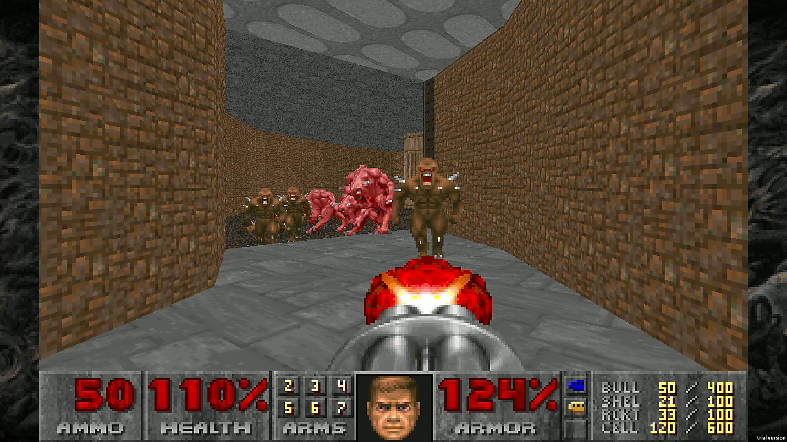
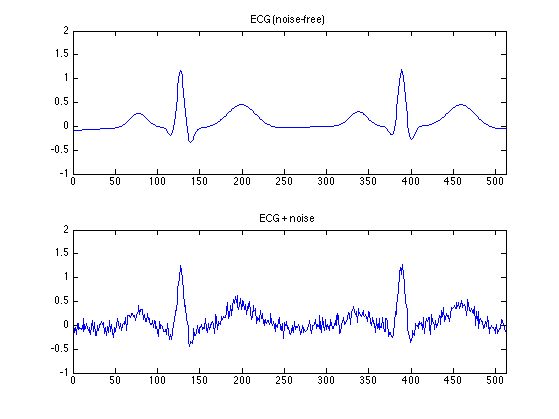

# Guía de Ejercicios 5 - Arreglos

```
Advertencia

La resolución conjunta o grupal de los ejercicios aquí presentes no está permitida, excepto en la medida en que puedas pedir ayuda a tus compañeros de clase y a otras personas, y siempre que esa ayuda no se reduzca a que otro haga el trabajo por vos.

El código fuente entregado por un estudiante debe ser escrito en su totalidad por dicha persona.
```

***<u>Condiciones de entrega:</u>***

| <b>¿Qué se entrega?</b>         | <b>¿Qué no se entrega?</b>                        |
| ----                            |   ----                                            |
| Archivos fuente/source (.c)     | Archivos objeto (.o)                              |
| Archivos encabezado/header (.h) | Archivos ejecutables (programa, app, a.out, etc.) |
| Bibliotecas específicas (.a)    |   |

Se deben entregar los tres ejercicios en un zip (usar template como ayuda para el formato).

**Importante:** Recordar validar **siempre** que no se reciben punteros **`NULL`**. En dicho caso, la función deberá retornar sin efectuar operación alguna y en caso de tener que retornar algún valor devolverá el valor `-1`.

<br>

## Ejercicios 5.1 - 5.5
Desarrolle un programa que solicite el ingreso de las calificaciones (como número enteros) del primer parcial de los estudiantes de Informática 1. El ingreso de calificaciones finalizará cuando se ingrese un once (11). Tener en cuenta que las calificaciones deberán ser números comprendidos entre 0 y 10 (0 significa ausente), por lo que se debe validar la carga de datos. Se podrán ingresar como máximo 25 calificaciones. Una vez finalizada la carga de datos, se pide computar e imprimir en pantalla las siguientes estadísticas:

### Ejercicio 5.1
- La cantidad de aprobados, desaprobados y ausentes (nota de aprobación: 6). Utilizar el siguiente prototipo:

```c
void clasificar_calificaciones(const int* calificaciones, int cantidad, int* aprobados, int* desaprobados, int* ausentes);
```

### Ejercicio 5.2
- El valor medio (promedio) de las calificaciones (teniendo en cuenta los ausentes). Utilizar el siguiente prototipo:

```c
float promedio_con_ausentes(const int* calificaciones, int cantidad);
```

### Ejercicio 5.3
- El valor medio (promedio) de las calificaciones (sin tener en cuenta los ausentes). Utilizar el siguiente prototipo:

```c
float promedio_sin_ausentes(const int* calificaciones, int cantidad);
```

### Ejercicio 5.4
- La calificación máxima ingresada y su ubicación (retornada por valor). Utilizar el siguiente prototipo:

```c
int calificacion_maxima(const int* calificaciones, int cantidad, int* maximo);
```

### Ejercicio 5.5
- La calificación mínima ingresada y su ubicación (retornada por valor). Utilizar el siguiente prototipo:

```c
int calificacion_minima(const int* calificaciones, int cantidad, int* minimo);
```

## Ejercicio 5.6
Implementar una función que reciba dos arreglos y sus longitudes, y copie el contenido del arreglo origen en el arreglo destino. La función deberá retornar la cantidad de **bytes** copiados. Recordar corroborar que el tamaño del arreglo destino es suficiente para efectuar la copia. Utilizar el siguiente prototipo:

```c
int arrcpy(float* arreglo_destino, int largo_destino, const float* arreglo_origen, int largo_origen);
```

## Ejercicio 5.7
Implementar una función que reciba dos arreglos y su longitud, y retorne **`1`** si son iguales y **`0`** si no lo son. Utilizar el siguiente prototipo:

```c
int son_iguales(const float* arreglo_a, const float* arreglo_b, int largo);
```

## Ejercicio 5.8
Implementar una función que reciba un arreglo y su longitud y retorne **`1`** si el mismo se encuentra ordenado (de menor a mayor) y **`0`** en caso contrario. Utilizar el siguiente prototipo:

```c
int esta_ordenado(const int* arreglo, int largo);
```

## Ejercicio 5.9
En informática, la [búsqueda lineal o búsqueda secuencial](https://es.wikipedia.org/wiki/B%C3%BAsqueda_lineal) es un método para encontrar un valor objetivo dentro de una lista. Ésta comprueba secuencialmente cada elemento de la lista con el valor objetivo hasta que es encontrado o hasta que todos los elementos hayan sido comparados. Se pide implementar una función que haciendo uso de dicho algoritmo devuelva la posición de un determinado elemento en un arreglo. En caso de que el elemento a buscar esté presente más de una vez, simplemente devolverá la posición de la primer occurrencia, y en caso de no estar presente en el arreglo, devolverá **`-1`**.

Utilizar el siguiente prototipo:

```c
int busqueda_lineal(const int* arreglo, int largo, int elemento);
```

## Ejercicio 5.10
Implementar una función que permita efectuar operaciones entre un vector y un escalar. Dicha función recibirá un arreglo de números reales, un número real, la operación a realizar entre ellos y el orden de los operandos.

Las operaciones soportadas son:
- Suma (`'+'`)
- Resta (`'-'`)
- Multiplicación (`'*'`)
- División (`'/'`)

Los ordenes soportados son:
- `ESCALAR_VECTOR` (0)
- `VECTOR_ESCALAR` (1)

Dado que una operación entre un vector y un escalar da como resultado otro vector, el resultado de la operación se almacenará en un arreglo de resultados. La función deberá retornar `ERROR` (-1) si ocurrió algún error, y `EXITO` (0) en caso contrario. Utilizar el siguiente prototipo:

```c
int computar_arreglo_escalar(const double* vector, int largo, double escalar, char operacion, double* resultado);
```

## Ejercicio 5.11
Implementar una función que permita efectuar operaciones entre dos vectores. Dicha función recibirá dos arreglo de números reales y la operación a realizar entre ellos.

Las operaciones soportadas (todas elemento a elemento) son:
- Suma (`'+'`)
- Resta (`'-'`)
- Multiplicación (`'*'`)
- División (`'/'`)

Dado que una operación (elemento a elemento) entre dos vectores da como resultado otro vector, el resultado de la operación se almacenará en un arreglo de resultados. La función deberá retornar `ERROR` (-1) si ocurrió algún error, y `EXITO` (0) en caso contrario. Utilizar el siguiente prototipo:

```c
int computar_arreglo_arreglo(const double* vector_a, const double* vector_b, int largo, char operacion, double* resultado);
```

## Ejercicio 5.12
El producto escalar (o producto interno) es una operación entre vectores muy utilizada en juegos FPS (first-person shooter), tales como [Doom](https://es.wikipedia.org/wiki/Doom_(videojuego_de_1993)):



Esto se debe a que a través de dicha operación es posible obtener fácilmente el ángulo entre dos vectores, y por lo tanto, saber si el jugador está apuntando a un enemigo al momento de disparar lo cual podría ocasionar, por ejemplo, la destrucción de dicho enemigo. El secreto radica en que el producto escalar se puede computar de dos formas distintas:

**Ecuación 1:**


<br>

**Ecuación 2:**


Con lo cual el procedimiento típico es computar el producto escalar entre ambos vectores con la segunda ecuación y luego despejar el ángulo entre ambos con la primera. Finalmente, si el ángulo es menor a un determinado ángulo límite, se puede considerar que el jugador está apuntando a dicho enemigo.

Para poder lograr lo anterior, una empresa de videojuegos nos pide que desarrollemos las siguientes funciones:

a) Implementar una función que compute el producto escalar de dos vectores de **dimensión 3**, utilizando la ecuación 2. Utilizar el siguiente prototipo:

```c
double producto_escalar_vec3(const double* vector_a, const double* vector_b);
```

b) Implementar una función que compute la norma de un vector de **dimensión 3**, la cual es requerida por la ecuación 1 y se calcula de la siguiente manera:

<div align="center">

</div>

Utilizar el siguiente prototipo:

```c
double norma_vec3(const double* vector);
```

c) Implementar una función que compute el ángulo de separación (en radianes) entre dos vectores, a partir de la ecuación 1 y haciendo uso de las funciones ya desarrolladas en los puntos **`a)`** y **`b)`**. Utilizar el siguiente prototipo:

```c
double angulo_entre_vec3(const double* vector_a, const double* vector_b);
```

d) Implementar una sencilla función que compruebe si un enemigo está siendo apuntado por el jugador, lo cual se puede deducir comprobando si el ángulo entre el vector del enemigo y el vector de la mira del jugador es menor que un cierto valor límite. Se deberá devolver **`1`** en caso que sea cierto y **`0`** en caso contrario. Hacer uso de las funciones ya desarrolladas en los puntos **`a)`**, **`b)`** y **`c)`**. Utilizar el siguiente prototipo:

```c
int esta_apuntando_al_enemigo(const double* vector_mira, const double* vector_enemigo, double angulo_limite);
```

## Ejercicio 5.13
La derivada nos da información acerca de la razón de cambio de una función y en el caso de la derivada discreta, nos da información sobre dicha razón de cambio pero aplicado a un conjunto de elementos númericos discretos. En este ejercicio, se pide implementar una función que calcule la derivada discreta (por diferencias finitas) del contenido de un vector de enteros. El cálculo de dicha derivada discreta se realiza de la siguiente manera:
```
Para x = 0 => (∂f/∂x)[x] = 0
Para x > 0 => (∂f/∂x)[x] = F[x] − F[x − 1]

Siendo x el índice del arreglo.

Por ejemplo:
  (∂f/∂x)[0] = 0
  (∂f/∂x)[1] = F[1] - F[0]
  (∂f/∂x)[2] = F[2] - F[1]
  ...
```

Utilizar el siguiente prototipo:

```c
void derivar(const double* arreglo, int largo, double* derivada);
```

## Ejercicio 5.14
Implementar una función que permita evaluar una función polinómica en un punto, a partir de un
vector de coeficientes y su grado recibidos como parámetros. Utilizar el siguiente prototipo:

```c
double evaluar_polinomio(const double* coeficientes, int grado, double x);
```

## Ejercicio 5.15
Implementar una función que permita obtener los coeficientes de la función derivada de una función polinómica, a partir de un vector de coeficientes y su grado recibidos como parámetros. Utilizar el siguiente prototipo:

```c
void derivar_polinomio(const double* coeficientes, int grado, double* coeficientes_derivada);
```

## Ejercicio 5.16
Escribir un programa que genere una tabla con muestras de un polinomio ingresado por teclado. El programa debe pedir al usuario el grado del polinomio, los coeficientes del mismo, el valor del comienzo del intervalo de muestreo, el valor final y la cantidad de muestras. Para ello, implementar una función con el siguiente prototipo:

```c
void muestrear_polinomio(const double* coeficientes, int grado, double inicio, double fin, double* muestras, int cantidad_muestras);
```

## Ejercicio 5.17
El [filtro de media móvil](https://es.wikipedia.org/wiki/Media_m%C3%B3vil) es un filtro digital ampliamente utilizado porque es intuitivo, fácil de implementar y rápido de calcular. En dicho filtro, se toman los últimos **`N`** valores muestreados (conocido como "ventana de muestreo") y se calcula su valor medio (promedio). El resultado es una señal suavizada que elimina parte del ruido de alta frecuencia (variaciones rápidas entre muestras cercanas). Un caso de uso de dicho filtro es para la eliminación de ruido (denoising) de una señal de electrocardiografía (ECG):



Se pide implementar dicho filtro teniendo en cuenta lo siguiente:
- Se utilizará el arreglo como un buffer circular. Eso quiere decir que la nueva muestra que se agrega se debe colocar en el lugar indicado por **`indice`** y luego se debe incrementar dicha variable en uno (1). En caso de que se haya alcanzado el final del arreglo, **`indice`** debe volver a cero (0). 
- La función deberá retornar la nueva muestra filtrada, la cual se obtiene del promedio de los valores presentes en la ventana. 

Utilizar el siguiente prototipo:

```c
double filtro_media_movil(double* ventana, int* indice, int largo, double muestra);
```

## Ejercicio 5.18
Implementar una función que permita efectuar operaciones entre una matriz y un escalar. Dicha función recibirá un arreglo multidimensional de números reales, un número real, la operación a realizar entre ellos y el orden de los operandos.

Las operaciones soportadas son:
- Suma (`'+'`)
- Resta (`'-'`)
- Multiplicación (`'*'`)
- División (`'/'`)

Los ordenes soportados son:
- `ESCALAR_MATRIZ` (0)
- `MATRIZ_ESCALAR` (1)

Dado que una operación entre una matriz y un escalar da como resultado otra matriz, el resultado de la operación se almacenará en una matriz de resultados. La función deberá retornar `ERROR` (-1) si ocurrió algún error, y `EXITO` (0) en caso contrario. Utilizar el siguiente prototipo:

```c
int computar_matriz_escalar(const double* matriz, int filas, int columnas, double escalar, char operacion, double* resultado);
```

## Ejercicio 5.19
Implementar una función que permita efectuar operaciones entre dos matrices. Dicha función recibirá dos arreglo de números reales y la operación a realizar entre ellas.

Las operaciones soportadas (todas elemento a elemento) son:
- Suma (`'+'`)
- Resta (`'-'`)
- Multiplicación (`'*'`)
- División (`'/'`)

Dado que una operación (elemento a elemento) entre dos matrices da como resultado otra matriz, el resultado de la operación se almacenará en una matriz de resultados. La función deberá retornar `ERROR` (-1) si ocurrió algún error, y `EXITO` (0) en caso contrario. Utilizar el siguiente prototipo:

```c
int computar_matriz_matriz(const double* matriz_a, const double* matriz_b, int filas, int columnas, char operacion, double* resultado);
```

## Ejercicio 5.20
Una matriz de `NxM` elementos es simétrica, si y solo si:
- Es una matriz cuadrada (m = n)
- a_ij = a_ji para todo i, j = 1, 2, 3, 4, ..., n.

Donde a_ij representa el elemento que está en la fila i-ésima y en la columna j-
ésima de A.

En base a lo anterior, implementar una función que reciba una matriz cuadrada de
enteros y su dimensión, y retorne **`1`** si es una matriz simétrica y **`0`** si no lo es. Utilizar el siguiente prototipo:

```c
int es_simetrica(const int* matriz, int dimension);
```

## Ejercicio 5.21
La traza de una matriz cuadrada de `NxM` elementos se define como la suma de los elementos de su diagonal principal. Es decir, **`t(A) = a_11 + a_22 + a_33 + ... + a_nn`**.

En base a lo anterior, implementar una función que reciba una matriz cuadrada de
doubles y su dimensión, y retorne el valor de su traza. Utilizar el siguiente prototipo:

```c
double traza(const double* matriz, int dimension);
```

## Ejercicio 5.22
Implementar una función que reciba una matriz cuadrada de doubles de dimensión 3 y compute el valor de su determinante. Utilizar el siguiente prototipo:

```c
double determinante_mat3(const double* matriz);
```

## Ejercicio 5.23
Implementar una función que reciba una matriz de enteros de `NxM` elementos, y compute la transpuesta de dicha matriz. Utilizar el siguiente prototipo:

```c
void transpuesta(const double* matriz, int filas, int columnas, double* matriz_transpuesta);
```

## Ejercicio 5.24
Implementar una función que reciba una matriz cuadrada de doubles de dimensión 3, y
compute su matriz inversa. En caso de poder calcularse deberá retornar **`EXITO`** (0) y en caso de no poder hacerlo, **`ERROR`** (-1). Utilizar el siguiente prototipo:

```c
int inversa_mat3(const double* matriz, double* matriz_inversa);
```

## Ejercicio 5.25
El producto de matrices es una operación muy utilizada en el ámbito de la róbotica, debido a que aplicar una rotación o una traslación a un robot es muy sencillo mediante el uso de las [transformaciones homogéneas](https://es.wikipedia.org/wiki/Matriz_de_transformaci%C3%B3n), las cuales consisten básicamente en multiplicar el estado actual del robot (descrito por un vector) por una matriz de transformación.


Es por eso que como parte de un proyecto de investigación donde se está desarrollando una biblioteca para el control de robots móviles, se nos pide implementar una función que reciba dos matrices de dimensiones `NxM` y `MxP`, y compute el producto de ambas. En caso de poder calcularse deberá retornar **`EXITO`** (0) y en caso de no poder hacerlo, **`ERROR`** (-1). Utilizar el siguiente prototipo:

```c
int producto_matricial(const double* matriz_a, int filas_a, int columnas_a, const double* matriz_b, int filas_b, int columnas_b, double* matriz_resultado, int* filas, int* columnas);
```

## Ejercicio 5.26
El [tatetí](https://es.wikipedia.org/wiki/Tres_en_l%C3%ADnea) es un juego de lápiz y papel entre dos jugadores: **`O`** y **`X`**, que marcan los espacios de un tablero de 3×3 alternadamente.

Para una versión electrónica del mismo, una empresa de videojuegos nos pide que desarrollemos las siguientes funciones:

a) Implementar una función que marque el tablero en la posición indicada con el símbolo del jugar indicado (**`'O'`** o **`'X'`**). En caso de no poder marcarse dicha casilla (ya sea porque no se encuentra dentro de los límites del tablero o porque ya se encuentra marcada previamente) se deberá retornar **`ERROR`** (-1). En caso contrario se deberá retornar **`EXITO`** (0). Utilizar el siguiente prototipo:

```c
int marcar_tablero(const char* tablero, int fila, int columna, char jugador);
```

b) Implementar una función que compruebe si el juego ha terminado. Los posibles desenlaces del mismo son:
- `JUEGO_EN_CURSO`(0)
- `GANA_JUGADOR_X`(1)
- `GANA_JUGADOR_O`(2)
- `EMPATE`(3)

Utilizar el siguiente prototipo:

```c
int comprobar_tablero(const char* tablero);
```
