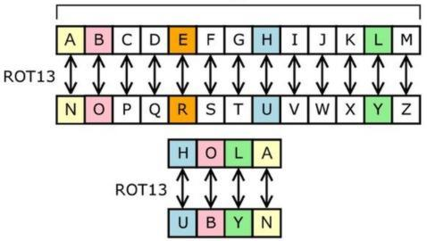

# Guía de Ejercicios 6 - Strings

```
Advertencia

La resolución conjunta o grupal de los ejercicios aquí presentes no está permitida, excepto en la medida en que puedas pedir ayuda a tus compañeros de clase y a otras personas, y siempre que esa ayuda no se reduzca a que otro haga el trabajo por vos.

El código fuente entregado por un estudiante debe ser escrito en su totalidad por dicha persona.
```

**Condiciones de entrega:**

| **¿Qué se entrega?**            | **¿Qué no se entrega?**                           |
| ----                            |   ----                                            |
| Archivos fuente/source (.c)     | Archivos objeto (.o)                              |
| Archivos encabezado/header (.h) | Archivos ejecutables (programa, app, a.out, etc.) |
| Bibliotecas específicas (.a)    |                                                   |

Se deben entregar los ejercicios en un archivo zip (usar template como ayuda para el formato).

**Importante:** Recordar validar **siempre** que no se reciben punteros **`NULL`**. En dicho caso, la función deberá retornar sin efectuar operación alguna y en caso de tener que retornar algún valor, devolverá el valor `-1`.

## Ejercicio 6.1
Implementar tu propia version de la función `strlen` de la biblioteca estándar `string`. Utilizar el siguiente prototipo:

```c
int strlen(const char* string);
```

## Ejercicio 6.2
Implementar tu propia version de la función `strcpy` de la biblioteca estándar `string`. Utilizar el siguiente prototipo:

```c
void strcpy(char* dest, const char* orig);
```

## Ejercicio 6.3
Implementar tu propia version de la función `strncpy` de la biblioteca estándar `string`. Utilizar el siguiente prototipo:

```c
void strncpy(char* dest, const char* orig, int n);
```

## Ejercicio 6.4
Implementar tu propia version de la función `strcmp` de la biblioteca estándar `string`. Utilizar el siguiente prototipo:

```c
int strcmp(const char* s1, const char* s2);
```

## Ejercicio 6.5
Implementar tu propia version de la función `strncmp` de la biblioteca estándar `string`. Utilizar el siguiente prototipo:

```c
int strncmp(const char* s1, const char* s2, int n);
```

## Ejercicio 6.6
Implementar tu propia version de la función `strcat` de la biblioteca estándar `string`. Utilizar el siguiente prototipo:

```c
void strcat(char* dest, const char* orig);
```

## Ejercicio 6.7
Implementar tu propia version de la función `strcasecmp` de la biblioteca estándar `string` (). Utilizar el siguiente prototipo:

```c
int strcasecmp(const char* s1, const char* s2);
```

## Ejercicio 6.8
Implementar tu propia version de la función `strncasecmp` de la biblioteca estándar `string`. Utilizar el siguiente prototipo:

```c
int strncasecmp(const char* s1, const char* s2, int n);
```

## Ejercicio 6.9
Implementar una función que convierta todos los caracteres correspondientes a letras a mayúsculas. La función deberá retornar la cantidad de caracteres convertidos. Utilizar el siguiente prototipo:

```c
int strupper(char* string);
```

## Ejercicio 6.10
Implementar una función que convierta todos los caracteres correspondientes a letras a minúsculas. La función deberá retornar la cantidad de caracteres convertidos. Utilizar el siguiente prototipo:

```c
int strlower(char* string);
```

## Ejercicio 6.11
Implementar una función que invierta el casing, es decir, los caracteres que se encuentren en mayúsculas los convierta a minúsculas y los que están en minúsculas a mayúsculas. La función deberá retornar la cantidad de caracteres convertidos. Utilizar el siguiente prototipo:

```c
int strinvertcase(char* string);
```

## Ejercicio 6.12
Implementar una función que reciba un string e invierta el orden de sus caracteres. Utilizar el siguiente prototipo:

```c
void invertir(char* string);
```

**Ejemplo:**
```
               __________
              |          |
("batman") -->| invertir |--> "namtab"
              |__________|
```

## Ejercicio 6.13
Implementar una función que reciba un string y devuelva `1` si el mismo es palíndromo, caso contrario devolverá `0`. Utilizar el siguiente prototipo:

```c
int es_palindromo(const char* string);
```

**Ayuda:** Un palíndromo es una palabra o frase que se lee igual en un sentido que en otro. Si se trata de números en lugar de letras, se llama capicúa.

## Ejercicio 6.14
Implementar una función que reciba un string representando un número entero, y convierta su contenido al número que representa. Utilizar el siguiente prototipo:

```c
int str_to_int(const char* string);
```

## Ejercicio 6.15
Implementar una función que reciba un string representando un número real, y convierta su contenido al número que representa. Utilizar el siguiente prototipo:

```c
float str_to_float(const char* string);
```

## Ejercicio 6.16
Implementar una función que reciba un string y dos caracteres. La función deberá reemplazar las apariciones del primer caracter en el string por el segundo. Se deberá retornar la cantidad de veces que se reemplazó el caracter. Utilizar el siguiente prototipo:

```c
int string_reemplazar(char* string, char caracter_original, char caracter_nuevo);
```

## Ejercicio 6.17
Implementar una función que cambie la extensión original del nombre de un archivo por una nueva. Utilizar el siguiente prototipo:

```c
void cambiar_extension(char* nombre_archivo, const char* nueva_extension);
```

**Ejemplo:**
```
                           ___________________
                          |                   |
("archivo.txt", "ini") -->| cambiar_extension |--> "archivo.ini"
                          |___________________|
```

## Ejercicio 6.18
Implementar una función que reciba un string y un caracter y la misma deberá retornar cuántas veces aparece dicho caracter en el string recibido. Utilizar el siguiente prototipo:

```c
int contar_caracter(const char* string, char caracter);
```

## Ejercicio 6.19
Implementar una función que reciba un string y una palabra y la misma deberá retornar cuántas veces aparece dicha palabra en el string recibido. Utilizar el siguiente prototipo:

```c
int contar_palabra(const char* string, const char* palabra);
```

**Importante:** No se deben distinguir mayúsculas y minúsculas, es decir, `"Casa"` y `"CASA"` son apariciones válidas de `"casa"`.

## Ejercicio 6.20
Un sistema de codificación muy famoso es el código Morse, desarrollado por Samuel Morse en 1832, para su uso en el sistema telegráfico. El mismo asigna una serie de puntos y rayas a cada letra del alfabeto, a cada dígito y a unos cuantos caracteres especiales.

Implementar una función que convierta un caracter en su equivalente en código Morse. La misma retornará `1` de haber sido posible la codificación o `0` en caso contrario. Utilizar el siguiente prototipo:

```c
int a_morse(char caracter, char* codigo_morse);
```

## Ejercicio 6.21
Las fechas se expresan en varios formatos distintos, siendo dos de los más comunes `"21/09/98"` y `"21 de Septiembre de 1998"`.

Implementar una función que reciba una fecha en el primer formato (`"01/09/98"`) y devuelva la fecha en el segundo formato (`"21 de Septiembre de 1998"`). De poder realizar la conversión devolverá `1`, en caso contrario devolverá `0`. Utilizar el siguiente prototipo:

```c
int convertir_fecha_a_letras(const char* fecha_en_numeros, char* fecha_en_letras);
```

## Ejercicio 6.22
Las fechas se expresan en varios formatos distintos, siendo dos de los más comunes `"21 de Septiembre de 1998"` y `"21/09/98"`

Implementar una función que reciba una fecha en el primer formato (`"21 de Septiembre de 1998"`) y devuelva la fecha en el segundo formato (`"01/09/98"`). De poder realizar la conversión devolverá `1`, en caso contrario devolverá `0`. Utilizar el siguiente prototipo:

```c
int convertir_fecha_a_numeros(const char* fecha_en_letras, char* fecha_en_numeros);
```

## Ejercicio 6.23
En criptografía, el cifrado César, también conocido como cifrado por desplazamiento o ROT13, es una de las técnicas de cifrado más simples y más usadas. Es un tipo de cifrado por sustitución en el que una letra en el texto original es reemplazada por otra letra que se encuentra un número fijo de posiciones más adelante en el alfabeto. Por ejemplo, con un desplazamiento de 3, la A sería sustituida por la D (situada 3 lugares a la derecha de la A), la B sería reemplazada por la E, etc. Este método debe su nombre a Julio César, que lo usaba para comunicarse con sus generales.

Entonces, para codificar un mensaje, simplemente se debe buscar cada letra de la línea del texto original y escribir la letra correspondiente en la línea codificada. Para decodificarlo se debe hacer lo contrario.



Implementar una función que codifique una frase usando el cifrado César. Utilizar el siguiente prototipo:

```c
void cifrar_cesar(const char* frase_original, char* frase_codificada);
```


## Ejercicio 6.18
Escriba un programa que ayude al usuario a realizar conversiones sencillas y especificar que tipo de conversiones desea realizar. <br>
Para ello el usuario deberá especificar los nombres de las unidades(metros, millas, pulgadas, etc) que desea usar y, el programa deberá responder a preguntas sencillas como:<br>
¿Cuántos metros hay en una milla?<br>
¿Cuántas millas hay en dos yardas?<br>

**Nota:** Tenga encuenta que en este caso sólo son válidas las medidas de longitud presentadas a continuación. En cualquier otro caso, el programa deberá informar que no es posible realizar dicha conversión.

| medida    | equivalente en metros | fórmula para pasar de metro a la nueva medida:                        | 
|:--------: |:--------------:|:---------:|
|    milla  | 1609 metros    |para obtener un resultado aproximado, multiplica el valor de longitud por 1609| 
|    pie    | 0.3048 metros  |para obtener un resultado aproximado, divide el valor de longitud entre 3,281 |
|    pulgada|  0.0254 metros |divide el valor de longitud entre 39,37                                       |

- Realice una función con el prototipo <b> int es_valida(char*) </b> que recibirá la pregunta del usuario y validará si la misma tiene medidas válidas de conversión. De ser válida devuelve 1, si no, devuelve 0.
- Luego deberá realizar funciones que conviertan de una unidad a otra, tenga en cuenta trabajar con variables flotantes.


## Ejercicio 6.21
Escriba un programa que use la generación de números aleatorios para crear oraciones.<br> Se deberán usar cuatro arrays apuntadores a char llamados: articulo, sustantivo, verbo y preposicion. El programa deberá crear una oración seleccionando una palabra al azar de cada uno de los arrays en el orden siguiente: <br>
1)articulo, 2) sustantivo, 3)verbo, 4)preposicion, 5)articulo y 6) sustantivo.<br>
Conforme se seleccione cada palabra, deberá ser concatenada con las palabras anteriores en un string lo suficientemente extenso para contener toda la oración.<br>
Las palabras deben estar separadas por un espacio y el programa deberá generar diez oraciones de este tipo.
<br> 
Los strings que deben utilizar para el armado de oraciones son:<br>
|     Artículo    |   Sustantivo |   Verbo | Preposición |
|:----------------|:------------:|:-------:|-----------:|
| el              |       niño   |  manejo |      hacia  |
| un              |    perro     |  salto  | desde       |
| uno             |    gato      |  corrio |   sobre     |
| algun           |    pueblo    |camino   |    debajo   |
| ningun          |    auto      |esquivo  |    entre    |

**Nota:** Utilizar el siguiente prototipo para la función generadora de oraciones: <b>int gen_oracion(char *)</b>. Devuelve 1 si logra hacer la oración ó 0 si no lo logra y, recibe una cadena donde se irán concatenando las palabras.
<br><br>

## Ejercicio 6.22
Realizar un programa que reciba tres números enteros y luego proceda a realizar un sorteo. Se deberá sortear veinte veces y, cada vez que aparezca algún número elegido por el usuario, deberá irse armando la palabra <b>BINGO</b>.<br>
Se deberá informar el número que sale sorteado y, en caso de que salga algún número elegido por el usuario, se debe mostrar en pantalla las letras del BINGO que se completaron hasta el momento.<br> 
De completarse la palabra el usuario recibirá un mensaje de felicitación por haber conseguido el BINGO.<br>
- Realizar una función <b>int sorteo(int , int, int)</b> que reciba los números del usuario y retorne 1 de poder hacer el sorteo, 0 si hubo algún error ó 2 de haberse conseguido el BINGO. 
- Realizar otra función <b> void felicitacion() </b> que imprima por pantalla la felicitación de haber conseguido el BINGO.

**Nota:** Los números a trabajar deberán encontrarse entre el 0 y el 10 además, para la realización del sorteo puede usar la función rand().

## Ejercicio 6.23
Escribir un programa que le pida a tres alumnos: el apellido, número de legajo (entero de 8 cifras) y la nota de un examen. A continuación se deberá mostrar la información en 3 cadenas de caracteres. El orden deberá ser: legajo, apellido y nota de examen. Las lineas deberán mostrarse de menor a mayor según el número de legajo. Por ejemplo,<br>

|  legajo | apellido | nota |
|:----: |:----:|:----:|
|  1634804 | Levi    | 6 |
|  1736500 | Herrera | 9 |
|  1757843 | Potter  | 7 |

**Nota:** Usar el siguiente prototipo: <b>int validador_personas(char *, char *,char *)</b> para corroborar que las notas ingresadas sean váidas (del 1 al 10), que los legajos tengan 7 cifras enteras y además, que los nombres tengan 20 caracteres o menos. De ser válido la función retorna 1, de no serlo retorna 0. 
<br>Si el ingreso es válido use una función <b> void mostrar_personas(char *,char *, char *)</b> para comparar los legajos y luego imprimir por pantalla la información en el orden ya mecionado.

***Ayuda:*** Para comparar los legajos puede usar la función <b>atoi()</b>. Puede consultar el man para más información sobre dicha función.

## Referencias 
Algunos ejercicios fueron obtenidos y adaptados de:
- Guía de Trabajos Prácticos 2011 - Informática I - Departamento de Electrónica - UTN FRBA
- Cómo programar en C/C++ y Java - Harvey M. Deitel y Paul J. Deitel
