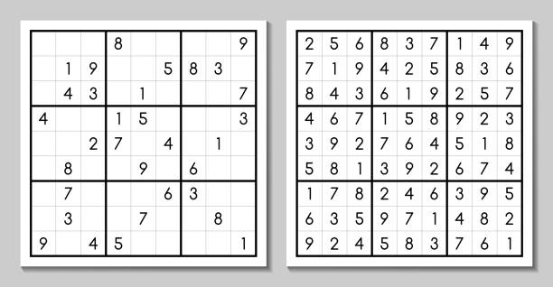

# Guía de Ejercicios 7 - Arreglos Multidimensionales

```
Advertencia

La resolución conjunta o grupal de los ejercicios aquí presentes no está permitida, excepto en la medida en que puedas pedir ayuda a tus compañeros de clase y a otras personas, y siempre que esa ayuda no se reduzca a que otro haga el trabajo por vos.

El código fuente entregado por un estudiante debe ser escrito en su totalidad por dicha persona.
```

**Condiciones de entrega:**

| **¿Qué se entrega?**            | **¿Qué no se entrega?**                           |
| ----                            |   ----                                            |
| Archivos fuente/source (.c)     | Archivos objeto (.o)                              |
| Archivos encabezado/header (.h) | Archivos ejecutables (programa, app, a.out, etc.) |
| Bibliotecas específicas (.a)    |                                                   |

Se deben entregar los ejercicios en un archivo zip (usar template como ayuda para el formato).

**Importante:** Recordar validar **siempre** que no se reciben punteros **`NULL`**. En dicho caso, la función deberá retornar sin efectuar operación alguna y en caso de tener que retornar algún valor, devolverá el valor `-1`.

## Ejercicio 7.1
Implementar una función que permita efectuar operaciones entre una matriz y un escalar. Dicha función recibirá un arreglo multidimensional de números reales, un número real, la operación a realizar entre ellos y el orden de los operandos.

Las operaciones soportadas son:
- Suma (`'+'`)
- Resta (`'-'`)
- Multiplicación (`'*'`)
- División (`'/'`)

Los ordenes de operandos soportados son:
- `ESCALAR_MATRIZ` (`0`)
- `MATRIZ_ESCALAR` (`1`)

Dado que una operación entre una matriz y un escalar da como resultado otra matriz, el resultado de la operación se almacenará en una matriz de resultados. La función deberá retornar `ERROR` (`1`) si ocurrió algún error, y `EXITO` (`0`) en caso contrario. Utilizar el siguiente prototipo:

```c
int computar_matriz_escalar(const double* matriz, int filas, int columnas, double escalar, char operacion, int orden, double* resultado);
```

## Ejercicio 7.2
Implementar una función que permita efectuar operaciones entre dos matrices. Dicha función recibirá dos arreglo de números reales y la operación a realizar entre ellas.

Las operaciones soportadas (todas elemento a elemento) son:
- Suma (`'+'`)
- Resta (`'-'`)
- Multiplicación (`'*'`)
- División (`'/'`)

Dado que una operación (elemento a elemento) entre dos matrices da como resultado otra matriz, el resultado de la operación se almacenará en una matriz de resultados. La función deberá retornar `ERROR` (`1`) si ocurrió algún error, y `EXITO` (`0`) en caso contrario. Utilizar el siguiente prototipo:

```c
int computar_matriz_matriz(const double* matriz_a, const double* matriz_b, int filas, int columnas, char operacion, double* resultado);
```

## Ejercicio 7.3
Una matriz de `NxM` elementos es simétrica, si y solo si:
- Es una matriz cuadrada (m = n)
- a_ij = a_ji para todo i, j = 1, 2, 3, 4, ..., n.

Donde a_ij representa el elemento que está en la fila i-ésima y en la columna j-ésima de A.

En base a lo anterior, implementar una función que reciba una matriz cuadrada de enteros y su dimensión, y retorne `1` si es una matriz simétrica y `0` si no lo es. Utilizar el siguiente prototipo:

```c
int es_simetrica(const int* matriz, int dimension);
```

## Ejercicio 7.4
La traza de una matriz cuadrada de `NxM` elementos se define como la suma de los elementos de su diagonal principal. Es decir, `t(A) = a_11 + a_22 + a_33 + ... + a_nn`.

En base a lo anterior, implementar una función que reciba una matriz cuadrada de doubles y su dimensión, y retorne el valor de su traza. Utilizar el siguiente prototipo:

```c
double traza(const double* matriz, int dimension);
```

## Ejercicio 7.5
Implementar una función que reciba una matriz cuadrada de doubles de dimensión 3, y compute el valor de su determinante. Utilizar el siguiente prototipo:

```c
double determinante_mat3(const double* matriz);
```

## Ejercicio 7.6
Implementar una función que reciba una matriz de enteros de `NxM` elementos, y compute la transpuesta de dicha matriz. Utilizar el siguiente prototipo:

```c
void transpuesta(const double* matriz, int filas, int columnas, double* matriz_transpuesta);
```

## Ejercicio 7.7
Implementar una función que reciba una matriz cuadrada de doubles de dimensión 3, y compute su matriz inversa. La función deberá retornar `ERROR` (`1`) si ocurrió algún error, y `EXITO` (`0`) en caso contrario. Utilizar el siguiente prototipo:

```c
int inversa_mat3(const double* matriz, double* matriz_inversa);
```

## Ejercicio 7.8
El producto de matrices es una operación muy utilizada en el ámbito de la róbotica, debido a que aplicar una rotación o una traslación a un robot es muy sencillo mediante el uso de las [transformaciones homogéneas](https://es.wikipedia.org/wiki/Matriz_de_transformaci%C3%B3n), las cuales consisten básicamente en multiplicar el estado actual del robot (descrito por un vector) por una matriz de transformación.


Es por eso que como parte de un proyecto de investigación donde se está desarrollando una biblioteca para el control de robots móviles, se nos pide implementar una función que reciba dos matrices de dimensiones `NxM` y `MxP`, y compute el producto de ambas. La función deberá retornar `ERROR` (`1`) si ocurrió algún error, y `EXITO` (`0`) en caso contrario. Utilizar el siguiente prototipo:

```c
int producto_matricial(const double* matriz_a, int filas_a, int columnas_a, const double* matriz_b, int filas_b, int columnas_b, double* matriz_resultado, int* filas, int* columnas);
```

## Ejercicio 7.9
El [tatetí](https://es.wikipedia.org/wiki/Tres_en_l%C3%ADnea) es un juego de lápiz y papel entre dos jugadores: `O` y `X`, que marcan los espacios de un tablero de 3×3 alternadamente.

Para una versión electrónica del mismo, una empresa de videojuegos nos pide que desarrollemos las siguientes funciones:

a) Implementar una función que marque el tablero en la posición indicada con el símbolo del jugar indicado (`'O'` o `'X'`). En caso de no poder marcarse dicha casilla (ya sea porque no se encuentra dentro de los límites del tablero o porque ya se encuentra marcada previamente) se deberá retornar `ERROR` (`1`), y se retornará `EXITO` (`0`) en caso contrario. Utilizar el siguiente prototipo:

```c
int marcar_jugada(char* tablero, int fila, int columna, char jugador);
```

b) Implementar una función que obtenga el estado del juego. Los posibles estados del mismo son:
- `JUEGO_EN_CURSO` (`0`)
- `GANADOR_JUGADOR_X` (`1`)
- `GANADOR_JUGADOR_O` (`2`)
- `EMPATE` (`3`)

Utilizar el siguiente prototipo:

```c
int obtener_estado(const char* tablero);
```

## Ejercicio 7.10
El objetivo del juego matemático japonés `sudoku` es rellenar una cuadrícula de 9x9 celdas (81 casillas) dividida en subcuadrículas de 3x3 (también llamadas "cajas" o "regiones") con las cifras del 1 al 9 partiendo de algunos números ya dispuestos en algunas de las celdas. La forma inicial del juego es que sean nueve elementos diferenciados, que no se deben repetir en una misma fila, columna o subcuadrícula.



Implementar una función que compruebe si una solución dada es correcta sabiendo que:

1. Se deben completar **todas** las casillas con un número comprendido entre el `1` y el `9`.
1. No puede repetirse ninguna cifra en la misma fila, ni en la misma columna ni en la misma subcuadrícula.

La función deberá retornar `SOLUCION_VALIDA` (`1`) si la solución es correcta, y `SOLUCION_INVALIDA` (`0`) en caso contrario. Utilizar el siguiente prototipo:

```c
int comprobar_sudoku(const int* tablero);
```

## Referencias 
Algunos ejercicios fueron obtenidos y adaptados de:
- Guía de Trabajos Prácticos 2011 - Informática I - Departamento de Electrónica - UTN FRBA
- Guía de Ejercicios - Algoritmos y Programación I - UBA FIUBA
